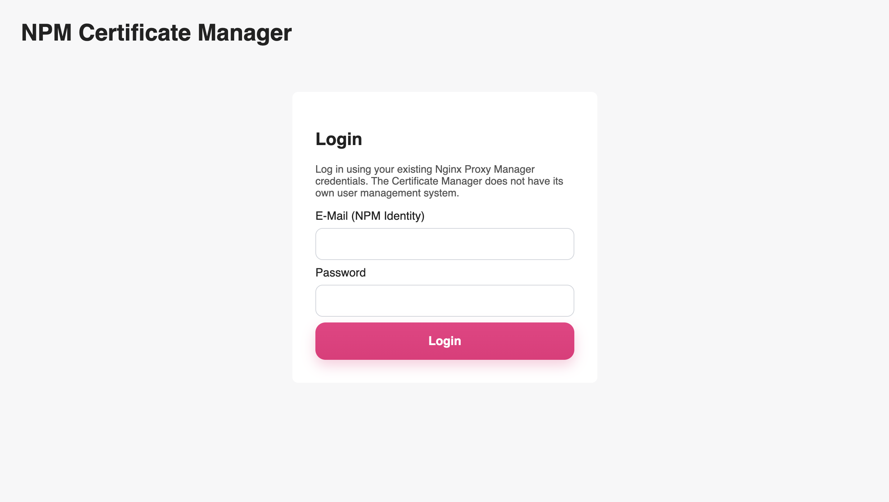
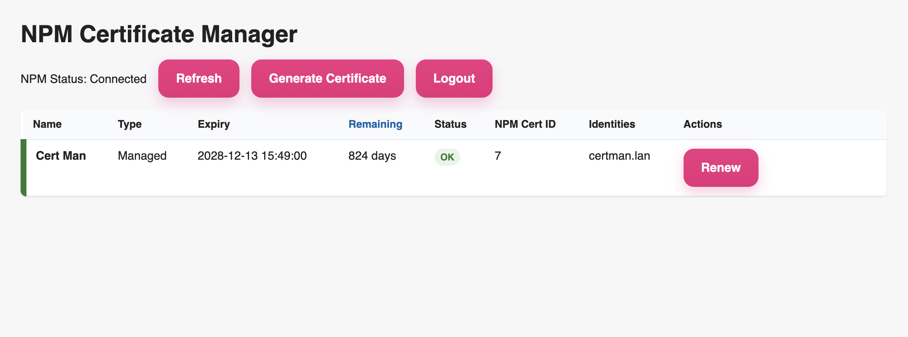

# NPM Certificate Manager

This project is a small certificate manager for Nginx Proxy Manager (NPM). It monitors custom certificates, evaluates expiration dates and can renew custom certificates via the NPM API using a local Root CA.

## Login with NPM identity

<picture>
  
</picture>

## Easy Dashboard

<picture>
  
</picture>

The official image is hosted at: ghcr.io/mini-maya/npm-cert-manager:latest

Quick Docker start (only the minimal environment variables):

```bash
docker run -d --name npm-cert-manager \
  -p 8080:8000 \
  -v "$(pwd)/data:/app/data" \
  -v "$(pwd)/secrets:/app/secrets" \
  -e SESSION_SECRET="change-me-to-a-long-random-value" \
  ghcr.io/mini-maya/npm-cert-manager:latest
```

Note: The scheduler requires `NPM_SERVICE_IDENTITY` and `NPM_SERVICE_SECRET`/`NPM_SERVICE_SECRET_FILE`; without them the web UI runs and you can create a Root CA via the UI.

## Environment variables

All available environment variables, whether optional, and their defaults:

| Variable | Required? | Default | Description |
|---|---:|---|---|
| NPM_URL | optional | http://nginx-proxy-manager:81/api | Base URL of the Nginx Proxy Manager API |
| NPM_SERVICE_IDENTITY | optional* | (none) | Service account identity for the scheduler (e.g. service@example.com) |
| NPM_SERVICE_SECRET | optional* | (none) | Service account password (or set via _FILE) |
| NPM_SERVICE_SECRET_FILE | optional* | /app/secrets/npm_service_password.txt | Path to a file containing the service secret (Docker-secret convention) |
| RENEW_BEFORE_DAYS | optional | 30 | Days before expiry to attempt renewal |
| CHECK_INTERVAL_SECONDS | optional | 21600 | Polling interval in seconds |
| KEY_SIZE | optional | 2048 | Size of generated keys |
| KEY_TYPE | optional | rsa | Key type (e.g. rsa, ec) |
| CA_KEY_PATH | optional | /app/secrets/ca.key | Path to Root CA private key |
| CA_CERT_PATH | optional | /app/secrets/ca.crt | Path to Root CA certificate |
| DATA_DIR | optional | /app/data | Directory for persistent data |
| SESSION_SECRET | optional | change-me | Session secret for web sessions (use a strong random value in production) |
| SESSION_COOKIE_NAME | optional | cert_manager_session | Name of the session cookie |
| SESSION_COOKIE_SECURE | optional | false | Whether the session cookie has the Secure flag (true/false) |
| SESSION_MAX_AGE_SECONDS | optional | 86400 | Max session age in seconds |

* The NPM_SERVICE_* variables are only required for automated scheduler tasks; the web UI works without them, but scheduled renewals need a service account.

Using NPM_SERVICE_SECRET_FILE: create a file that contains only the service account password (avoid a trailing newline). Example:

```bash
echo -n 's3cr3t-password' > ./secrets/npm_service_password.txt
```

Mount that file into the container (e.g. -v "$(pwd)/secrets:/app/secrets") and set NPM_SERVICE_SECRET_FILE=/app/secrets/npm_service_password.txt. Alternatively, provide the secret via Docker secrets or your orchestrator's secret management.

Important design decisions:

- No direct volume access to NPM's internal certificate files.
- No automatic Nginx reload is triggered by the application.
- The manager delegates authentication to NPM's own `/api/tokens` endpoint.
- The Root CA private key is stored outside the Git repo and never exposed through the UI or API.
- The scheduler uses a dedicated NPM service account; user sessions are separate and in-memory only.

## Production Docker Compose

```bash
cp .env.example .env
# edit .env and set NPM_SERVICE_IDENTITY / NPM_SERVICE_SECRET and SESSION_SECRET
mkdir -p data secrets
# place your CA files in ./secrets/ca.key and ./secrets/ca.crt

docker compose up --build -d
```

## Docker run

```bash
docker run -d --name npm-cert-manager \
  --network npm_default \
  -p 8080:8000 \
  -v "$(pwd)/data:/app/data" \
  -v "$(pwd)/secrets:/app/secrets" \
  -e NPM_URL="http://nginx-proxy-manager:81/api" \
  -e NPM_SERVICE_IDENTITY="service@example.com" \
  -e NPM_SERVICE_SECRET="super-secret" \
  -e SESSION_SECRET="change-me" \
  -e DATA_DIR="/app/data" \
  -e CA_KEY_PATH="/app/secrets/ca.key" \
  -e CA_CERT_PATH="/app/secrets/ca.crt" \
  npm-cert-manager:latest
```

## Development Compose

```bash
docker compose -f docker-compose.dev.yml up --build
```

This starts a local NPM instance for testing, along with the Certificate Manager.

## Environment variables

See `.env.example` for the complete list.

## Security notes

- Never commit `ca.key` or `ca.crt` to Git.
- Keep the CA key in a secure, backed-up secret store or bind mount.
- Do not log certificate content or private keys.
- Use dedicated NPM service credentials for scheduler automation.

## Root CA initialization

If `ca.key` and `ca.crt` do not exist yet, the dashboard shows a prominent `Create Root CA` button. It creates a local Root CA in the configured directory, mirroring the legacy bash-script behavior (but using Python `cryptography` instead of `openssl` shell calls).

## Manual renewal

Use the web UI to trigger renewals manually. After a successful upload, the app records a `reload_required` state and shows a warning. It does not trigger a reload because the NPM source code does not expose a safe direct reload API for custom certificates in the supported way.
